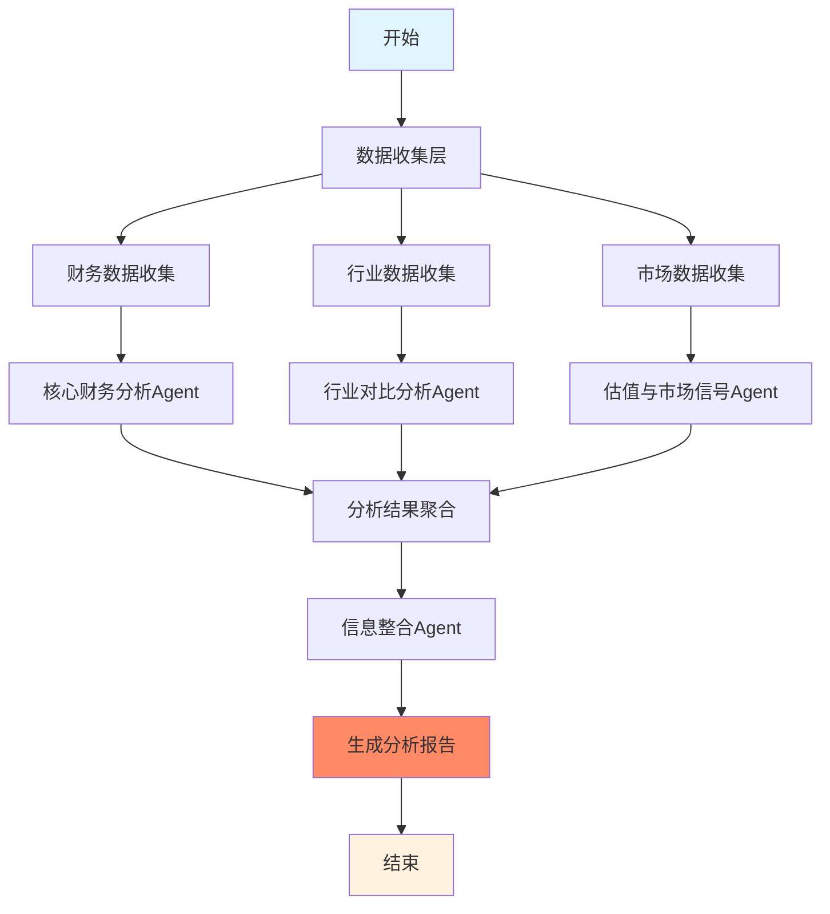

# A股分析Multi-Agent System 技术方案与系统设计

## 一、项目概述

### 1.1 项目背景
构建一套专门针对A股市场的智能分析系统，通过Multi-Agent协作机制，为投资者提供全面、专业的投资分析报告。

### 1.2 核心目标
- 构建专业化的A股公司分析Multi-Agent工作流
- 实现核心财务指标、行业对比、估值分析的系统化评估
- 生成结构化的投资分析报告，包含数据支撑和来源
- 基于金字塔原理组织报告结构，提供可执行的投资建议

### 1.3 技术架构选型
基于TradingAgents项目的最佳实践：
- **工作流引擎**：LangGraph（有向无环图DAG架构）
- **状态管理**：TypedDict + Annotated（类型安全的状态管理）
- **LLM架构**：双模型架构（深度思考模型 + 快速响应模型）
- **数据源**：AKShare（A股数据）+ Tushare（备选）
- **记忆系统**：分布式专业化记忆（向量数据库）

## 二、系统架构设计

### 2.1 整体架构



### 2.2 Agent设计详细说明

#### 2.2.1 核心财务指标分析Agent (Financial Metrics Agent)
**职责**：
- 分析营收与净利润的历史增长趋势
- 计算和评估净资产收益率（ROE）
- 分析资产负债表健康度
- 评估现金流量表质量
- 计算股东回报指标（分红率、股息率等）

**输入**：
- 股票代码
- 分析时间范围
- 财务报表数据

**输出**：
- 财务健康评分（0-100）
- 关键财务指标摘要
- 趋势分析结果
- 风险提示

#### 2.2.2 行业对比与竞争优势分析Agent (Industry Analysis Agent)
**职责**：
- 识别公司所属行业及细分领域
- 分析行业整体增长趋势
- 对比同行业头部企业的关键指标
- 评估公司竞争地位

**输入**：
- 目标公司信息
- 行业分类数据
- 同行业公司列表

**输出**：
- 行业地位评估
- 竞争优势分析
- 行业发展前景
- 对标企业比较表

#### 2.2.3 估值与市场信号分析Agent (Valuation Agent)
**职责**：
- 分析股权变动情况
- 评估股东结构特点
- 计算PR值（PE/ROE）并分析趋势
- 识别市场信号和异常情况

**输入**：
- 股价数据
- 股东数据
- 市场估值指标

**输出**：
- 估值水平评估
- 股权结构分析
- 市场信号解读
- 投资时机建议

#### 2.2.4 信息整合Agent (Report Integration Agent)
**职责**：
- 整合各分析Agent的结果
- 基于金字塔原理组织报告
- 确保数据来源可追溯
- 生成投资建议

**输入**：
- 各Agent分析结果
- 报告模板

**输出**：
- 完整分析报告
- 投资评级（强烈推荐/推荐/中性/谨慎/回避）
- 风险提示
- 数据附录

### 2.3 状态管理设计

```python
class StockAnalysisState(TypedDict):
    """A股分析系统的全局状态"""
    # 基础信息
    stock_code: Annotated[str, "股票代码"]
    company_name: Annotated[str, "公司名称"]
    analysis_date: Annotated[str, "分析日期"]
    
    # 财务分析状态
    financial_report: Annotated[str, "财务分析报告"]
    financial_score: Annotated[float, "财务健康评分"]
    financial_metrics: Annotated[dict, "关键财务指标"]
    
    # 行业分析状态
    industry_report: Annotated[str, "行业对比报告"]
    industry_position: Annotated[str, "行业地位"]
    competitive_advantages: Annotated[list, "竞争优势列表"]
    
    # 估值分析状态
    valuation_report: Annotated[str, "估值分析报告"]
    pr_ratio: Annotated[float, "PR值(PE/ROE)"]
    shareholder_structure: Annotated[dict, "股东结构"]
    
    # 最终报告
    final_report: Annotated[str, "完整分析报告"]
    investment_rating: Annotated[str, "投资评级"]
    key_risks: Annotated[list, "主要风险"]
```

### 2.4 工作流编排

```python
# 基于LangGraph的工作流定义
workflow = StateGraph(StockAnalysisState)

# 添加节点
workflow.add_node("data_collection", data_collection_node)
workflow.add_node("financial_analysis", financial_analysis_node)
workflow.add_node("industry_analysis", industry_analysis_node)
workflow.add_node("valuation_analysis", valuation_analysis_node)
workflow.add_node("report_integration", report_integration_node)

# 定义边（工作流）
workflow.add_edge(START, "data_collection")
workflow.add_edge("data_collection", "financial_analysis")
workflow.add_edge("data_collection", "industry_analysis")
workflow.add_edge("data_collection", "valuation_analysis")
workflow.add_edge("financial_analysis", "report_integration")
workflow.add_edge("industry_analysis", "report_integration")
workflow.add_edge("valuation_analysis", "report_integration")
workflow.add_edge("report_integration", END)
```

## 三、数据源与工具设计

### 3.1 数据源选择

#### 主要数据源：AKShare
- **优势**：免费、数据全面、专注A股市场
- **使用场景**：
  - 财务报表数据：`stock_financial_report_sina`
  - 行业数据：`stock_industry_category_cninfo`
  - 股东数据：`stock_circulate_stock_holder`
  - 实时行情：`stock_zh_a_spot_em`

#### 备选数据源：Tushare Pro
- **优势**：数据质量高、接口稳定
- **劣势**：需要积分、有调用限制
- **使用场景**：关键数据的验证和补充

### 3.2 工具系统设计

```python
class AStockToolkit:
    """A股数据工具包"""
    
    def __init__(self, config):
        self.config = config
        self.cache_dir = config.get("cache_dir", "./cache")
        
    # 财务数据工具
    def get_financial_statements(self, stock_code: str, period: str):
        """获取财务报表"""
        pass
        
    def get_financial_indicators(self, stock_code: str):
        """获取财务指标"""
        pass
        
    # 行业数据工具
    def get_industry_classification(self, stock_code: str):
        """获取行业分类"""
        pass
        
    def get_industry_comparison(self, industry_code: str):
        """获取行业对比数据"""
        pass
        
    # 市场数据工具
    def get_stock_valuation(self, stock_code: str):
        """获取估值数据"""
        pass
        
    def get_shareholder_structure(self, stock_code: str):
        """获取股东结构"""
        pass
```

## 四、Agent实现策略

### 4.1 提示词工程

#### 财务分析Agent提示词模板
```python
FINANCIAL_ANALYST_PROMPT = """
你是一位专业的财务分析师，负责分析A股公司{company_name}({stock_code})的财务状况。

分析任务：
1. 营收与净利润分析
   - 分析近3-5年的营收增长趋势
   - 评估净利润率变化
   - 识别增长驱动因素

2. 盈利能力分析
   - 计算ROE、ROA等关键指标
   - 与行业平均水平对比
   - 评估盈利质量和可持续性

3. 财务健康度评估
   - 资产负债率分析
   - 流动性指标评估
   - 现金流质量分析

4. 股东回报分析
   - 历史分红记录
   - 股息率计算
   - 股东回报政策评估

可用数据：
{financial_data}

请基于以上数据，生成详细的财务分析报告，包括：
- 核心观点（50字以内）
- 详细分析（包含具体数据）
- 风险提示
- 财务评分（0-100分）

注意：所有结论必须有数据支撑，标注数据来源。
"""
```

### 4.2 LLM资源配置

```python
# 基于TradingAgents的双模型架构
LLM_CONFIG = {
    # 深度思考模型：用于信息整合和最终报告生成
    "deep_thinking_llm": "gpt-4o",  # 或自定义endpoint的强模型
    
    # 快速响应模型：用于各专业分析Agent
    "quick_thinking_llm": "gpt-4o-mini",  # 或ollama本地模型
    
    # 自定义endpoint配置
    "backend_url": "YOUR_CUSTOM_ENDPOINT",
    "api_key": "YOUR_API_KEY"
}
```

## 五、记忆系统设计

### 5.1 分布式记忆架构

```python
class StockAnalysisMemory:
    """股票分析记忆系统"""
    
    def __init__(self, memory_type: str):
        self.memory_type = memory_type  # financial/industry/valuation
        self.vector_store = self._init_vector_store()
        
    def add_analysis(self, stock_code: str, analysis: dict):
        """添加分析记录"""
        pass
        
    def get_similar_cases(self, query: str, k: int = 3):
        """获取相似案例"""
        pass
        
    def update_with_outcome(self, stock_code: str, actual_performance: dict):
        """基于实际表现更新记忆"""
        pass
```

### 5.2 学习与反馈机制

- **定期回顾**：每季度回顾历史分析的准确性
- **经验提取**：从成功和失败案例中提取模式
- **持续优化**：基于反馈调整分析权重和策略

## 六、输出报告设计

### 6.1 报告结构（金字塔原理）

```
投资分析报告
│
├── 核心结论（总论）
│   ├── 投资评级：[强烈推荐/推荐/中性/谨慎/回避]
│   ├── 目标价位：XXX元
│   └── 核心逻辑：一句话说明投资逻辑
│
├── 支撑论据（分论）
│   ├── 财务面分析
│   │   ├── 盈利能力：ROE=XX%，行业排名前X%
│   │   ├── 成长性：营收CAGR=XX%，利润CAGR=XX%
│   │   └── 财务健康：资产负债率=XX%，现金流充裕
│   │
│   ├── 行业面分析
│   │   ├── 行业地位：市占率第X，竞争优势明显
│   │   ├── 行业前景：预计未来3年行业CAGR=XX%
│   │   └── 竞争格局：寡头垄断/充分竞争
│   │
│   └── 估值面分析
│       ├── 绝对估值：PE=XX，PB=XX，合理区间
│       ├── 相对估值：较行业平均折价/溢价XX%
│       └── PR指标：PR=XX，历史分位XX%
│
├── 风险提示
│   ├── 主要风险1：具体描述
│   ├── 主要风险2：具体描述
│   └── 风险等级：[低/中/高]
│
└── 数据附录
    ├── 关键财务数据表
    ├── 行业对比数据表
    └── 数据来源说明
```

### 6.2 报告示例模板

```markdown
# {company_name}({stock_code}) 投资分析报告

## 一、投资结论

**投资评级**：推荐
**目标价位**：XX.XX元（当前价格：YY.YY元，潜在涨幅：ZZ%）
**核心逻辑**：公司是{industry}龙头企业，受益于{driver}，预计未来三年净利润CAGR达{growth_rate}%。

## 二、核心投资逻辑

### 2.1 财务表现优异
- **盈利能力领先**：2023年ROE达{roe}%，连续5年保持在20%以上，显著高于行业平均的{industry_roe}%
- **成长性突出**：过去3年营收CAGR为{revenue_cagr}%，净利润CAGR为{profit_cagr}%
- **现金流健康**：经营性现金流/净利润比率达{ocf_ratio}，现金创造能力强

### 2.2 行业地位稳固
- **市场份额**：在{segment}细分市场占有率达{market_share}%，排名第{rank}
- **竞争优势**：{competitive_advantage}
- **行业趋势**：{industry}行业预计未来3年CAGR为{industry_growth}%，公司有望充分受益

### 2.3 估值具有吸引力
- **绝对估值**：当前PE为{pe}倍，处于历史{pe_percentile}%分位
- **相对估值**：相比行业平均PE {industry_pe}倍，折价{discount}%
- **PR指标**：PR值为{pr_ratio}，处于合理区间

## 三、风险提示

1. **政策风险**：{policy_risk}
2. **市场风险**：{market_risk}
3. **经营风险**：{operation_risk}

## 四、数据附录

[详细财务数据表]
[行业对比数据表]
[历史估值数据表]

---
*数据来源：AKShare、公司年报
*分析日期：{analysis_date}
*免责声明：本报告仅供参考，不构成投资建议*
```

## 七、技术实现路线图

### Phase 1：基础框架搭建（Week 1）
- [ ] 创建项目结构
- [ ] 实现数据获取工具
- [ ] 搭建基础Agent框架
- [ ] 实现状态管理系统

### Phase 2：Agent开发（Week 2）
- [ ] 实现财务分析Agent
- [ ] 实现行业分析Agent
- [ ] 实现估值分析Agent
- [ ] 实现信息整合Agent

### Phase 3：系统集成（Week 3）
- [ ] 集成LangGraph工作流
- [ ] 实现记忆系统
- [ ] 优化提示词
- [ ] 添加错误处理

### Phase 4：测试与优化（Week 4）
- [ ] 单元测试
- [ ] 集成测试
- [ ] 性能优化
- [ ] 报告模板优化

## 八、部署与运维

### 8.1 部署架构
```yaml
# docker-compose.yml
version: '3.8'
services:
  analysis-service:
    build: .
    ports:
      - "8000:8000"
    environment:
      - LLM_PROVIDER=openai
      - BACKEND_URL=${BACKEND_URL}
    volumes:
      - ./cache:/app/cache
      - ./results:/app/results
```

### 8.2 配置管理
```python
# config.py
ANALYSIS_CONFIG = {
    "data_source": "akshare",  # akshare/tushare
    "cache_enabled": True,
    "cache_ttl": 3600,  # 1小时
    "max_retry": 3,
    "timeout": 30,
    "report_format": "markdown",  # markdown/pdf/html
}
```

## 九、扩展性设计

### 9.1 可扩展点
- **数据源扩展**：支持更多数据提供商
- **分析维度扩展**：ESG分析、技术分析等
- **报告格式扩展**：PDF、HTML、Excel等
- **语言支持**：中英文双语报告

### 9.2 插件架构
```python
class AnalysisPlugin:
    """分析插件基类"""
    def analyze(self, stock_data: dict) -> dict:
        raise NotImplementedError
        
    def get_report_section(self) -> str:
        raise NotImplementedError
```

## 十、性能指标

### 10.1 系统性能要求
- 单个股票完整分析时间：< 60秒
- 并发分析能力：10个股票同时分析
- 缓存命中率：> 80%
- 系统可用性：99.9%

### 10.2 分析质量指标
- 数据准确性：100%（来源可查）
- 报告完整性：涵盖所有关键维度
- 逻辑一致性：无自相矛盾
- 可读性评分：> 90分

---

*本文档将随项目进展持续更新*
