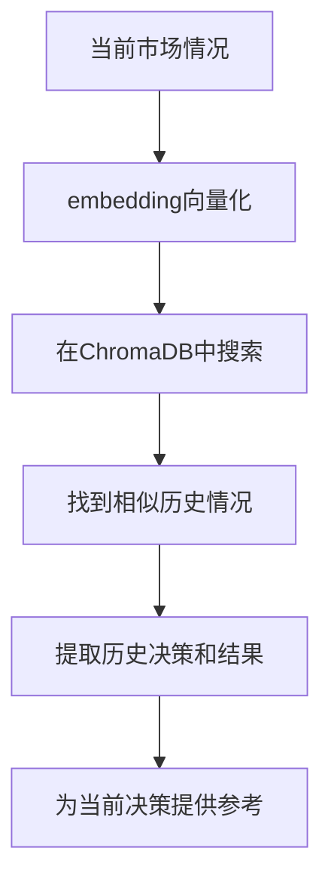

# TradingAgents Embedding模型配置解决方案

## 🎯 问题分析

您遇到的错误：
```
NotFoundError: Error code: 404 - {'message': 'No available providers at the moment: text-embedding-3-small'}
```

**原因**：TradingAgents使用了**记忆系统**(FinancialSituationMemory)来存储和检索历史交易经验。这个系统需要embedding模型来进行向量化处理，但原代码硬编码了`text-embedding-3-small`模型。

## 🔧 解决方案

我已经修改了代码，让embedding模型变为可配置的。

### 修改的文件

1. **`tradingagents/default_config.py`** - 添加了embedding模型配置
2. **`tradingagents/agents/utils/memory.py`** - 移除硬编码，使用配置文件
3. **`.env.example`** - 添加了embedding模型配置示例

### 配置您的.env文件

请在您的`.env`文件中添加以下配置：

```bash
# Embedding模型 - 用于记忆系统的向量化处理
TRADINGAGENTS_EMBEDDING_MODEL=text-embedding-3-large
```

### 根据您的endpoint选择合适的embedding模型

由于您提到您的endpoint可以提供text-embedding模型，请根据您的服务商选择：

**常见的embedding模型选项**：
```bash
# OpenAI兼容
TRADINGAGENTS_EMBEDDING_MODEL=text-embedding-3-small
TRADINGAGENTS_EMBEDDING_MODEL=text-embedding-3-large
TRADINGAGENTS_EMBEDDING_MODEL=text-embedding-ada-002

# 其他providers可能支持的模型
TRADINGAGENTS_EMBEDDING_MODEL=embedding-001
TRADINGAGENTS_EMBEDDING_MODEL=bge-large-zh-v1.5
```

### 如何确定您endpoint支持的embedding模型

您可以通过以下方式查询：

```bash
# 查询可用模型
curl -H "Authorization: Bearer $OPENAI_API_KEY" \
     "$TRADINGAGENTS_BACKEND_URL/models" | grep -i embedding
```

或者测试特定embedding模型：

```bash
# 测试embedding模型
curl -X POST "$TRADINGAGENTS_BACKEND_URL/embeddings" \
  -H "Authorization: Bearer $OPENAI_API_KEY" \
  -H "Content-Type: application/json" \
  -d '{
    "model": "text-embedding-3-large",
    "input": "test text"
  }'
```

## 📝 记忆系统的作用

TradingAgents的记忆系统用于：

1. **存储历史交易经验** - 将过往的市场情况和决策结果存储
2. **智能检索** - 在新的交易决策时，找到相似的历史情况
3. **学习改进** - 从历史成功和失败中学习，避免重复错误
4. **上下文感知** - 为每个智能体提供相关的历史经验

### 记忆系统的工作流程



## 🛠️ 完整的配置示例

更新您的`.env`文件：

```bash
# 基础LLM配置
TRADINGAGENTS_LLM_PROVIDER=openai
TRADINGAGENTS_BACKEND_URL=https://oned.lvtu.in/v1
OPENAI_API_KEY=uk-aF9pXmR7zQoB3vL1jWkE8sYtU4iO2cDn

# 模型选择
TRADINGAGENTS_DEEP_THINK_LLM=deepseek-r1
TRADINGAGENTS_QUICK_THINK_LLM=gemini-2.5-pro

# 新增：Embedding模型配置
TRADINGAGENTS_EMBEDDING_MODEL=text-embedding-3-large

# 其他配置
TRADINGAGENTS_MAX_DEBATE_ROUNDS=2
TRADINGAGENTS_MAX_RISK_DISCUSS_ROUNDS=2
TRADINGAGENTS_ONLINE_TOOLS=true
```

## 🧪 测试embedding配置

创建一个简单的测试脚本：

```python
# test_embedding.py
import os
from openai import OpenAI

# 加载.env (如果使用)
def load_env_file():
    if os.path.exists(".env"):
        with open(".env", 'r') as f:
            for line in f:
                if line.strip() and not line.startswith('#') and '=' in line:
                    key, value = line.split('=', 1)
                    os.environ[key.strip()] = value.strip()

load_env_file()

# 测试embedding
client = OpenAI(base_url=os.getenv("TRADINGAGENTS_BACKEND_URL"))
embedding_model = os.getenv("TRADINGAGENTS_EMBEDDING_MODEL", "text-embedding-3-small")

try:
    response = client.embeddings.create(
        model=embedding_model,
        input="测试文本"
    )
    print(f"✅ Embedding模型 {embedding_model} 工作正常")
    print(f"向量维度: {len(response.data[0].embedding)}")
except Exception as e:
    print(f"❌ Embedding模型测试失败: {e}")
```

运行测试：
```bash
python test_embedding.py
```

## 🚀 重新运行TradingAgents

配置完成后，重新运行：

```bash
# 快速测试
python quick_test.py

# 或直接运行CLI
python -m cli.main
```

现在系统应该能正确使用您的自定义embedding模型了！

## ❓ 如果仍有问题

如果您的endpoint不支持embedding模型，可以考虑：

1. **联系服务商** - 询问是否提供embedding API
2. **使用其他embedding服务** - 如OpenAI官方API仅用于embedding
3. **禁用记忆系统** - 修改代码跳过记忆功能（不推荐，会损失学习能力）

请告诉我您的endpoint支持哪些embedding模型，我可以帮您进一步配置！