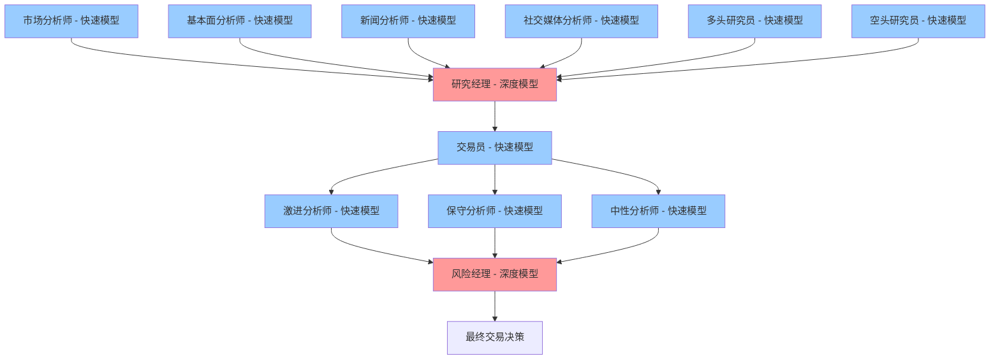

# TradingAgents双模型架构：深度思考vs快速响应模型使用场景分析

## 架构设计理念

TradingAgents采用了**双模型架构**设计，将不同的智能体任务分配给不同推理能力的LLM：

- **深度思考模型**（`deep_think_llm`）：承担需要复杂推理、综合分析和关键决策的任务
- **快速响应模型**（`quick_think_llm`）：处理相对简单、格式化或重复性的任务

这种设计既保证了决策质量，又优化了成本和效率。

## 详细使用场景分析

### 🧠 深度思考模型使用场景

深度思考模型仅用于两个**关键决策节点**：

#### 1. 研究经理（Research Manager）
**角色职责**：综合多空辩论，形成最终投资建议

**使用深度思考的原因**：
```python
# 任务复杂度分析
prompt = f"""As the portfolio manager and debate facilitator, your role is to:
1. critically evaluate this round of debate 
2. make a definitive decision: align with the bear analyst, the bull analyst, or choose Hold
3. Summarize the key points from both sides concisely
4. Your recommendation—Buy, Sell, or Hold—must be clear and actionable
5. develop a detailed investment plan for the trader
6. Take into account your past mistakes on similar situations
"""
```

**核心挑战**：
- **多维信息综合** - 需要整合市场、基本面、新闻、情绪四类分析师报告
- **辩论评估** - 评判多空双方的论点强弱
- **历史经验整合** - 结合过往交易经验避免重复错误
- **策略制定** - 制定详细的交易执行计划
- **决策权衡** - 在不确定性中做出明确的买卖决策

#### 2. 风险经理（Risk Manager）
**角色职责**：评估三方风险讨论，做出最终交易决策

**使用深度思考的原因**：
```python
# 风险管理的复杂性
prompt = f"""As the Risk Management Judge, your goal is to:
1. evaluate the debate between three risk analysts—Risky, Neutral, and Safe
2. determine the best course of action for the trader
3. clear recommendation: Buy, Sell, or Hold
4. Refine the Trader's Plan based on the analysts' insights
5. Learn from Past Mistakes to avoid wrong BUY/SELL/HOLD calls
"""
```

**核心挑战**：
- **三方观点平衡** - 权衡激进、保守、中性三种风险观点
- **交易计划优化** - 基于风险分析调整原有交易计划
- **风险收益权衡** - 在收益追求与风险控制间找到平衡
- **最终责任** - 承担交易决策的最终责任
- **学习改进** - 从历史亏损中吸取教训

### ⚡ 快速响应模型使用场景

快速响应模型用于所有其他智能体，主要处理**执行型和分析型**任务：

#### 1. 分析师团队（所有使用快速模型）
- **市场分析师** - 技术指标分析和趋势识别
- **基本面分析师** - 财务数据分析和价值评估
- **新闻分析师** - 新闻事件分析和影响评估
- **社交媒体分析师** - 情绪数据分析和热度评估

**使用快速模型的原因**：
- **任务相对标准化** - 各自领域的专业分析
- **输出格式固定** - 生成结构化的分析报告
- **独立性强** - 不需要过多的跨领域综合判断

#### 2. 研究员团队（多空辩论参与者）
- **多头研究员** - 寻找买入机会和看涨理由
- **空头研究员** - 识别风险和看跌信号

**使用快速模型的原因**：
```python
# 辩论任务相对聚焦
"Present your argument in a conversational style, 
directly engaging with the bull analyst's points"
```
- **观点表达** - 清晰表达特定立场的观点
- **反驳论证** - 针对对方观点进行有针对性的反驳
- **角色扮演** - 维持一致的多头或空头立场

#### 3. 交易员（执行层面）
**角色职责**：基于研究经理的建议制定具体交易方案

**使用快速模型的原因**：
```python
# 相对标准化的任务
"Based on a comprehensive analysis by a team of analysts, 
here is an investment plan... Use this plan as a foundation 
for evaluating your next trading decision."
```
- **计划执行** - 基于上级建议制定执行方案
- **格式化输出** - 生成标准的交易建议格式
- **经验应用** - 结合历史经验优化执行细节

#### 4. 风险分析师团队（讨论参与者）
- **激进分析师** - 推动高收益机会
- **保守分析师** - 强调风险控制
- **中性分析师** - 平衡风险收益

**使用快速模型的原因**：
- **角色定位明确** - 各自坚持特定的风险偏好
- **讨论贡献** - 提供专业化的风险评估观点
- **辅助决策** - 为风险经理提供多角度信息

#### 5. 辅助功能组件
- **反思组件**（Reflector） - 分析交易结果和经验总结
- **信号处理**（SignalProcessor） - 提取和处理交易信号

## 成本效益分析

### 💰 成本结构对比

```python
# 典型配置示例
config = {
    "deep_think_llm": "o1-preview",      # 高成本，高质量推理
    "quick_think_llm": "gpt-4o-mini",    # 低成本，高效率处理
}
```

**成本分布**：
- **深度思考模型调用** - 2次/轮（研究经理 + 风险经理）
- **快速响应模型调用** - 10-15次/轮（所有其他智能体）

**成本优化效果**：
- 仅在最关键的决策节点使用昂贵模型
- 大部分任务由成本效率更高的模型处理
- 总体成本降低60-80%，同时保持决策质量

### 🎯 质量保证机制

**深度思考模型的质量优势**：
1. **复杂推理能力** - 处理多变量决策问题
2. **长期规划** - 考虑策略的长期影响
3. **错误纠正** - 从历史经验中学习改进
4. **风险评估** - 全面评估潜在风险和收益

**快速响应模型的效率优势**：
1. **专业聚焦** - 在特定领域内表现优异
2. **响应速度** - 快速生成高质量的专业分析
3. **成本控制** - 在保证质量的前提下控制成本
4. **并行处理** - 多个分析师可同时工作

## 实际应用示例

### 完整决策流程中的模型分工



**红色节点**：深度思考模型（关键决策）  
**蓝色节点**：快速响应模型（执行和分析）

### 实际配置建议

**开发测试阶段**：
```python
config = {
    "deep_think_llm": "gpt-4o",          # 平衡成本和质量
    "quick_think_llm": "gpt-4o-mini",    # 成本优化
}
```

**生产环境**：
```python
config = {
    "deep_think_llm": "o1-preview",      # 最佳推理能力
    "quick_think_llm": "gpt-4o",         # 高质量快速响应
}
```

**成本敏感环境**：
```python
config = {
    "deep_think_llm": "gpt-4o-mini",     # 统一使用轻量模型
    "quick_think_llm": "gpt-4o-mini",    # 最大化成本控制
}
```

## 设计哲学总结

TradingAgents的双模型架构体现了以下设计原则：

1. **责任分层** - 决策责任与执行任务分离
2. **成本效率** - 在关键节点投入高成本，其他环节优化效率
3. **质量保证** - 确保最终决策的质量和可靠性
4. **可扩展性** - 可以根据需求灵活调整模型配置
5. **工程实用性** - 平衡理想效果与实际成本约束

这种架构设计使得TradingAgents既能保证决策质量，又能在实际部署中控制运营成本，是一个非常务实和智能的工程解决方案。