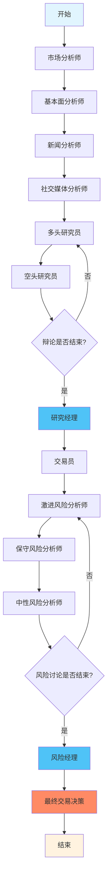

# TradingAgents项目技术深度解析与上手指南

## 1. 项目概述 (High-Level Overview)

### 核心业务价值

TradingAgents是一个**多智能体LLM驱动的金融交易框架**，其核心价值在于：

**解决的核心问题：**
- 传统交易决策依赖单一分析师视角，容易产生认知偏差和信息盲区
- 人工交易决策缺乏系统性、一致性和可扩展性
- 金融市场数据源众多且复杂，需要多维度综合分析

**创新价值：**
- **模拟真实交易公司架构**：通过多个专业化AI智能体协作，复现真实交易公司的分工协作模式
- **多维度风险控制**：通过多轮辩论机制确保决策的理性性和全面性
- **可解释的决策链条**：每个交易决策都有完整的分析报告和推理过程
- **学习与反思能力**：系统能从历史交易中学习，不断优化决策质量

**目标用户：**
- 量化交易研究者和从业者
- 金融AI应用开发者
- 多智能体系统研究者
- 金融科技公司和对冲基金

### 功能模块划分

TradingAgents包含以下四大核心功能模块：

1. **分析师团队 (Analyst Team)**
   - 市场分析师：技术指标分析和价格趋势预测
   - 基本面分析师：财务数据和企业价值评估
   - 新闻分析师：宏观经济和行业新闻影响分析
   - 社交媒体分析师：社交媒体情绪和市场情绪分析

2. **研究团队 (Research Team)**
   - 多头研究员：寻找买入机会的乐观派分析
   - 空头研究员：识别风险和卖出信号的谨慎派分析
   - 研究经理：协调辩论并形成最终投资建议

3. **交易员 (Trader)**
   - 综合所有分析师和研究员的建议
   - 制定具体的交易策略和执行计划
   - 利用历史记忆进行决策优化

4. **风险管理团队 (Risk Management)**
   - 激进分析师：推动高收益交易机会
   - 保守分析师：强调风险控制和资本保护
   - 中性分析师：平衡收益与风险
   - 风险经理：最终风险评估和交易批准

## 2. 系统架构设计 (System Architecture)

### 架构图描述

TradingAgents采用基于LangGraph的**有向无环图(DAG)架构**，实现多智能体的顺序协作和条件分支：



**关键组件及数据流：**

1. **状态管理层 (State Management)**
   - `AgentState`: 全局状态对象，在所有智能体间传递
   - `InvestDebateState`: 投资研究辩论状态
   - `RiskDebateState`: 风险管理讨论状态

2. **智能体编排层 (Agent Orchestration)**
   - `TradingAgentsGraph`: 主控制器，负责整个流程编排
   - `ConditionalLogic`: 条件判断逻辑，控制智能体间的流转
   - `GraphSetup`: 图结构初始化和节点配置

3. **数据获取层 (Data Layer)**
   - 多源数据集成：FinnHub、Yahoo Finance、Reddit、Google News
   - 实时数据与缓存数据切换机制
   - 数据预处理和格式化

4. **记忆与学习层 (Memory & Learning)**
   - `FinancialSituationMemory`: 财务情况记忆组件
   - 反思机制：从历史交易中学习经验
   - 上下文感知的记忆检索

### 目录结构解读

```
TradingAgents/
├── tradingagents/                    # 核心框架包
│   ├── agents/                       # 智能体定义
│   │   ├── analysts/                 # 分析师智能体
│   │   │   ├── market_analyst.py     # 市场分析师：技术指标分析
│   │   │   ├── fundamentals_analyst.py # 基本面分析师：财务分析
│   │   │   ├── news_analyst.py       # 新闻分析师：宏观新闻分析
│   │   │   └── social_media_analyst.py # 社交媒体分析师：情绪分析
│   │   ├── researchers/              # 研究员智能体
│   │   │   ├── bull_researcher.py    # 多头研究员：寻找买入机会
│   │   │   └── bear_researcher.py    # 空头研究员：识别风险信号
│   │   ├── risk_mgmt/               # 风险管理智能体
│   │   │   ├── aggressive_debator.py # 激进风险分析师
│   │   │   ├── conservative_debator.py # 保守风险分析师
│   │   │   └── neutral_debator.py    # 中性风险分析师
│   │   ├── trader/                  # 交易员智能体
│   │   │   └── trader.py            # 核心交易决策逻辑
│   │   ├── managers/                # 管理员智能体
│   │   │   ├── research_manager.py  # 研究团队协调员
│   │   │   └── risk_manager.py      # 风险管理协调员
│   │   └── utils/                   # 智能体工具库
│   │       ├── agent_states.py      # 状态定义
│   │       ├── agent_utils.py       # 通用工具
│   │       └── memory.py            # 记忆与学习组件
│   ├── dataflows/                   # 数据流管理
│   │   ├── interface.py             # 数据接口统一封装
│   │   ├── finnhub_utils.py         # FinnHub API集成
│   │   ├── yfin_utils.py            # Yahoo Finance集成
│   │   ├── reddit_utils.py          # Reddit情绪数据
│   │   ├── googlenews_utils.py      # Google新闻数据
│   │   └── stockstats_utils.py      # 技术指标计算
│   ├── graph/                       # 图结构管理
│   │   ├── trading_graph.py         # 主控制器
│   │   ├── setup.py                 # 图初始化配置
│   │   ├── propagation.py           # 状态传播逻辑
│   │   ├── conditional_logic.py     # 条件判断逻辑
│   │   ├── reflection.py            # 反思学习机制
│   │   └── signal_processing.py     # 信号处理
│   └── default_config.py            # 默认配置文件
├── cli/                             # 命令行接口
│   ├── main.py                      # CLI主入口
│   ├── models.py                    # CLI数据模型
│   └── utils.py                     # CLI工具函数
├── main.py                          # Python API入口
├── requirements.txt                 # 依赖清单
└── pyproject.toml                   # 项目配置
```

## 3. 核心技术栈解析 (Core Technology Stack)

| 技术名称 | 在项目中的作用 | 学习建议 |
|---------|---------------|----------|
| **LangGraph** | 多智能体工作流编排的核心框架，负责智能体间的状态传递和条件分支 | 重点掌握StateGraph、条件边(conditional_edges)、工具节点(ToolNode)的使用 |
| **LangChain** | LLM应用开发框架，提供提示模板、工具调用、消息处理等基础能力 | 关注ChatPromptTemplate、MessagesPlaceholder、工具绑定(bind_tools)机制 |
| **OpenAI/Anthropic/Google LLM** | 多种大语言模型提供推理能力，支持深度思考和快速响应两种模式 | 理解不同模型的特性，如o1-preview用于深度思考，gpt-4o-mini用于快速响应 |
| **Pandas** | 数据处理和分析的核心库，处理股价、技术指标、新闻数据等 | 掌握DataFrame操作、时间序列处理、数据清洗和聚合 |
| **YFinance** | Yahoo Finance数据源，获取股票价格、成交量等基础市场数据 | 了解股票数据获取、历史价格查询、技术指标计算 |
| **FinnHub** | 专业金融数据API，提供新闻、财务报表、内部人交易等高质量数据 | 重点学习新闻API、公司基本面数据、情绪指标获取 |
| **StockStats** | 技术分析指标计算库，提供MACD、RSI、布林带等常用指标 | 掌握各种技术指标的计算方法和参数配置 |
| **PRAW (Reddit API)** | Reddit社交媒体数据抓取，用于获取散户情绪和讨论热度 | 学习Reddit API使用、情绪分析、热门话题提取 |
| **Rich & Typer** | 现代化CLI界面开发，提供美观的交互式命令行体验 | 掌握富文本输出、进度条、表格展示、命令行参数处理 |
| **ChromaDB** | 向量数据库，用于存储和检索历史交易记忆，支持语义搜索 | 理解向量embedding、相似度搜索、记忆存储机制 |
| **Feedparser** | RSS新闻源解析，从各种新闻网站获取最新资讯 | 学习RSS解析、新闻内容提取、时间戳处理 |
| **Backtrader** | 量化交易回测框架，用于验证交易策略的历史表现 | 掌握策略回测、性能指标计算、风险评估 |

## 4. 关键代码深度解析 (Key Code Walkthrough)

### 4.1 核心业务逻辑：TradingAgentsGraph.propagate()

```python
# 位置: tradingagents/graph/trading_graph.py
def propagate(self, company_name: str, trade_date: str) -> Tuple[Dict, str]:
    """
    核心业务逻辑：通过多智能体协作完成股票交易决策
    
    Args:
        company_name (str): 股票代码，如"NVDA"、"AAPL"
        trade_date (str): 交易日期，格式"YYYY-MM-DD"
    
    Returns:
        Tuple[Dict, str]: (完整状态字典, 最终交易决策)
    """
    
    # 1. 初始化状态 - 创建所有智能体共享的状态对象
    initial_state = self.propagator.create_initial_state(company_name, trade_date)
    """
    初始状态包含：
    - messages: 智能体间的消息历史
    - company_of_interest: 目标股票代码  
    - trade_date: 交易日期
    - investment_debate_state: 投资辩论状态（多头vs空头）
    - risk_debate_state: 风险讨论状态（激进vs保守vs中性）
    - 各类分析报告的占位符
    """
    
    # 2. 配置图执行参数
    graph_args = self.propagator.get_graph_args()
    """
    关键配置：
    - stream_mode: "values" 表示流式输出每个节点的结果
    - recursion_limit: 防止智能体间无限循环，默认100次
    """
    
    # 3. 执行智能体工作流 - 这是核心执行逻辑
    final_state = None
    for chunk in self.graph.stream(initial_state, **graph_args):
        """
        流式执行工作流，chunk代表每个智能体节点的输出：
        - 分析师阶段：Market -> News -> Social -> Fundamentals
        - 研究阶段：Bull <-> Bear (多轮辩论) -> Research Manager  
        - 交易阶段：Trader
        - 风险阶段：Risky <-> Safe <-> Neutral (多轮讨论) -> Risk Manager
        """
        final_state = chunk
        
        # 4. 调试信息输出 - 便于跟踪执行过程
        if self.debug:
            self._print_debug_info(chunk)
    
    # 5. 提取最终决策
    """
    final_trade_decision包含：
    - 交易建议：BUY/HOLD/SELL
    - 决策理由：基于所有分析师报告的综合判断
    - 风险评估：预期收益和潜在风险
    """
    final_decision = final_state.get("final_trade_decision", "No decision made")
    
    return final_state, final_decision

def _print_debug_info(self, chunk):
    """
    调试信息打印：帮助开发者理解执行流程
    """
    for key, value in chunk.items():
        if key == "sender":
            print(f"\n=== {value} 智能体执行完成 ===")
        elif key.endswith("_report"):
            # 打印各种分析报告的摘要
            print(f"{key}: {value[:200]}...")
```

### 4.2 智能体协作逻辑：ConditionalLogic

```python
# 位置: tradingagents/graph/conditional_logic.py
class ConditionalLogic:
    """
    条件判断逻辑：控制智能体间的流转和循环
    这是整个系统的"大脑"，决定下一步执行哪个智能体
    """
    
    def should_continue_debate(self, state: AgentState) -> str:
        """
        投资辩论流控制：决定多头和空头研究员的辩论是否继续
        
        设计意图：
        1. 通过多轮辩论确保决策的全面性
        2. 避免单一观点的偏见
        3. 模拟真实交易公司的研究讨论过程
        """
        
        # 获取当前辩论轮数
        current_rounds = state["investment_debate_state"]["count"]
        max_rounds = 2 * self.max_debate_rounds  # 每轮包含多头和空头各一次发言
        
        # 1. 辩论轮数控制 - 防止无限辩论
        if current_rounds >= max_rounds:
            """
            达到最大辩论轮数时，转交给研究经理进行总结
            研究经理会综合双方观点，形成最终投资建议
            """
            return "Research Manager"
        
        # 2. 发言顺序控制 - 确保公平辩论
        last_speaker = state["investment_debate_state"]["current_response"]
        
        if last_speaker.startswith("Bull"):
            # 如果上一个发言者是多头研究员，下一个应该是空头
            return "Bear Researcher"
        else:
            # 否则轮到多头研究员发言
            return "Bull Researcher"
    
    def should_continue_risk_analysis(self, state: AgentState) -> str:
        """
        风险分析流控制：管理三方风险讨论的进程
        
        设计意图：
        1. 激进、保守、中性三方观点确保风险评估的全面性
        2. 模拟真实风险管理委员会的决策过程
        3. 平衡收益追求与风险控制
        """
        
        current_rounds = state["risk_debate_state"]["count"]
        max_rounds = 3 * self.max_risk_discuss_rounds  # 三方各发言一次为一轮
        
        # 1. 讨论轮数控制
        if current_rounds >= max_rounds:
            return "Risk Judge"  # 转交风险经理做最终决策
        
        # 2. 三方轮流发言逻辑
        last_speaker = state["risk_debate_state"]["latest_speaker"]
        
        """
        发言顺序：Risky -> Safe -> Neutral -> Risky -> ...
        这样的顺序设计确保：
        - 先提出激进观点（寻找机会）
        - 再提出保守观点（识别风险）  
        - 最后中性观点（平衡判断）
        """
        if last_speaker.startswith("Risky"):
            return "Safe Analyst"
        elif last_speaker.startswith("Safe"):
            return "Neutral Analyst"  
        else:
            return "Risky Analyst"
```

### 4.3 记忆与学习机制：FinancialSituationMemory

```python
# 位置: tradingagents/agents/utils/memory.py
class FinancialSituationMemory:
    """
    金融情况记忆系统：让AI智能体从历史交易中学习
    
    核心设计理念：
    1. 向量化存储：将市场情况转换为高维向量便于相似度搜索
    2. 情景学习：通过相似历史情况提供决策参考
    3. 持续优化：从交易结果中学习改进决策质量
    """
    
    def __init__(self, collection_name: str, persist_directory: str = "./chroma_db"):
        """
        初始化记忆系统
        
        Args:
            collection_name: 记忆集合名称，不同智能体使用不同集合
            persist_directory: 持久化存储目录
        """
        
        # 1. 向量数据库初始化
        self.client = chromadb.PersistentClient(path=persist_directory)
        """
        ChromaDB选择理由：
        - 支持向量相似度搜索
        - 内置embedding功能
        - 轻量级本地部署
        - 支持元数据过滤
        """
        
        # 2. 创建或获取记忆集合
        try:
            self.collection = self.client.create_collection(
                name=collection_name,
                metadata={"hnsw:space": "cosine"}  # 使用余弦相似度
            )
        except Exception:
            self.collection = self.client.get_collection(name=collection_name)
    
    def add_memory(self, situation: str, recommendation: str, outcome: float):
        """
        添加交易记忆：存储市场情况、决策建议和交易结果
        
        Args:
            situation: 市场情况描述（分析师报告的综合）
            recommendation: 交易建议（BUY/HOLD/SELL及理由）
            outcome: 交易结果（收益率，用于评估决策质量）
        """
        
        # 1. 生成唯一ID
        memory_id = f"memory_{int(time.time())}_{hash(situation) % 10000}"
        
        # 2. 存储到向量数据库
        self.collection.add(
            documents=[situation],  # 自动向量化的文本内容
            metadatas=[{
                "recommendation": recommendation,
                "outcome": outcome,
                "timestamp": time.time(),
                "decision_quality": "good" if outcome > 0 else "bad"
            }],
            ids=[memory_id]
        )
        """
        存储设计：
        - documents: 市场情况会被自动转换为向量
        - metadatas: 结构化数据便于后续过滤和分析
        - ids: 唯一标识符便于更新和删除
        """
    
    def get_memories(self, current_situation: str, n_matches: int = 3) -> List[Dict]:
        """
        检索相似历史记忆：基于当前市场情况找到最相似的历史案例
        
        Args:
            current_situation: 当前市场情况
            n_matches: 返回最相似的记忆数量
            
        Returns:
            相似记忆列表，按相似度排序
        """
        
        # 1. 向量相似度搜索
        results = self.collection.query(
            query_texts=[current_situation],
            n_results=n_matches,
            include=['documents', 'metadatas', 'distances']
        )
        """
        查询逻辑：
        1. 将当前情况转换为向量
        2. 计算与历史记忆的余弦相似度
        3. 返回最相似的N个案例
        4. 包含原始文档、元数据和相似度分数
        """
        
        # 2. 格式化返回结果
        memories = []
        if results['documents'] and results['documents'][0]:
            for i in range(len(results['documents'][0])):
                memory = {
                    "situation": results['documents'][0][i],
                    "recommendation": results['metadatas'][0][i]['recommendation'],
                    "outcome": results['metadatas'][0][i]['outcome'],
                    "similarity": 1 - results['distances'][0][i],  # 转换为相似度
                    "quality": results['metadatas'][0][i]['decision_quality']
                }
                memories.append(memory)
        
        return memories
    
    def reflect_and_learn(self, recent_outcome: float) -> str:
        """
        反思学习机制：分析最近的交易结果并生成学习洞察
        
        设计意图：
        1. 从成功和失败的交易中提取经验
        2. 识别决策模式和市场规律
        3. 为未来决策提供改进建议
        """
        
        # 1. 获取最近的交易记忆
        all_memories = self.collection.get(include=['metadatas'])
        
        if not all_memories['metadatas']:
            return "没有足够的历史数据进行反思学习。"
        
        # 2. 分析成功率和平均收益
        outcomes = [float(meta['outcome']) for meta in all_memories['metadatas']]
        success_rate = len([x for x in outcomes if x > 0]) / len(outcomes)
        avg_return = sum(outcomes) / len(outcomes)
        
        # 3. 生成学习洞察
        insights = []
        
        if recent_outcome > 0:
            insights.append(f"最近交易成功(+{recent_outcome:.2%})，继续保持当前策略。")
        else:
            insights.append(f"最近交易亏损({recent_outcome:.2%})，需要调整风险控制。")
        
        insights.append(f"历史成功率: {success_rate:.1%}")
        insights.append(f"平均收益率: {avg_return:.2%}")
        
        # 4. 策略建议
        if success_rate < 0.4:
            insights.append("建议: 提高分析深度，加强风险评估。")
        elif avg_return < 0:
            insights.append("建议: 调整仓位管理，控制单笔损失。")
        else:
            insights.append("建议: 当前策略表现良好，可适当提高仓位。")
        
        return "\n".join(insights)
```

## 5. 本地环境设置与启动指南 (Setup & Run Guide)

### 5.1 前置依赖要求

**系统要求：**
- Python 3.10 或更高版本
- 建议使用 Conda 作为虚拟环境管理器
- 至少 4GB 可用内存（用于向量数据库和LLM调用）

**必需的API密钥：**
1. **OpenAI API Key** - 用于驱动各类智能体的推理能力
2. **FinnHub API Key** - 获取金融新闻和基本面数据（免费版即可）

可选的API密钥：
- **Anthropic API Key** - 如需使用Claude系列模型
- **Google API Key** - 如需使用Gemini系列模型

### 5.2 详细安装步骤

**步骤1：克隆项目**
```bash
git clone https://github.com/TauricResearch/TradingAgents.git
cd TradingAgents
```

**步骤2：创建虚拟环境**
```bash
# 使用Conda（推荐）
conda create -n tradingagents python=3.13
conda activate tradingagents

# 或使用venv
python -m venv tradingagents
source tradingagents/bin/activate  # Linux/Mac
# tradingagents\Scripts\activate     # Windows
```

**步骤3：安装依赖**
```bash
pip install -r requirements.txt
```

**步骤4：配置环境变量**
```bash
# 创建环境变量文件
touch .env

# 添加必需的API密钥
echo "FINNHUB_API_KEY=your_finnhub_api_key_here" >> .env
echo "OPENAI_API_KEY=your_openai_api_key_here" >> .env

# 加载环境变量
export $(cat .env | xargs)

# 或者直接在终端中设置
export FINNHUB_API_KEY="your_finnhub_api_key"
export OPENAI_API_KEY="your_openai_api_key"
```

**步骤5：验证安装**
```bash
python -c "import tradingagents; print('安装成功！')"
```

### 5.3 启动方式

**方式1：交互式CLI界面（推荐新手）**
```bash
python -m cli.main
```
- 提供图形化的选择界面
- 支持多股票、多日期分析
- 实时显示智能体执行进度
- 美观的报告展示

**方式2：Python API调用（推荐开发者）**
```bash
python main.py
```

或在Python代码中使用：
```python
from tradingagents.graph.trading_graph import TradingAgentsGraph
from tradingagents.default_config import DEFAULT_CONFIG

# 基础使用
ta = TradingAgentsGraph(debug=True, config=DEFAULT_CONFIG.copy())
final_state, decision = ta.propagate("NVDA", "2024-05-10")
print(f"交易决策: {decision}")

# 自定义配置
config = DEFAULT_CONFIG.copy()
config["deep_think_llm"] = "gpt-4o-mini"  # 节省成本
config["max_debate_rounds"] = 2  # 增加辩论轮数
config["online_tools"] = True  # 使用实时数据

ta = TradingAgentsGraph(debug=True, config=config)
final_state, decision = ta.propagate("AAPL", "2024-12-01")
```

### 5.4 常见问题排查

**问题1：API密钥错误**
```bash
# 检查环境变量是否正确设置
echo $OPENAI_API_KEY
echo $FINNHUB_API_KEY

# 测试API连接
python -c "import openai; print('OpenAI连接正常')"
```

**问题2：依赖冲突**
```bash
# 清理pip缓存
pip cache purge

# 重新安装依赖
pip uninstall -r requirements.txt -y
pip install -r requirements.txt
```

**问题3：内存不足**
```bash
# 使用更轻量的模型配置
config["deep_think_llm"] = "gpt-4o-mini"
config["quick_think_llm"] = "gpt-4o-mini"
```

**问题4：ChromaDB权限问题**
```bash
# 检查数据库目录权限
ls -la ./chroma_db/
chmod -R 755 ./chroma_db/
```

### 5.5 性能优化建议

**成本控制：**
- 开发测试时使用 `gpt-4o-mini` 替代 `o1-preview`
- 将 `max_debate_rounds` 设置为1以减少API调用
- 使用缓存数据 (`online_tools = False`) 进行快速测试

**性能提升：**
- 使用SSD存储以提高ChromaDB性能
- 合理设置 `recursion_limit` 避免无限循环
- 启用debug模式监控执行流程

**扩展性配置：**
```python
# 高性能配置
config = {
    "deep_think_llm": "o1-preview",    # 深度思考
    "quick_think_llm": "gpt-4o",       # 快速响应
    "max_debate_rounds": 3,            # 充分辩论
    "max_risk_discuss_rounds": 2,      # 全面风险评估
    "online_tools": True,              # 实时数据
    "max_recur_limit": 200,           # 更高的递归限制
}
```

---

## 总结

TradingAgents是一个设计精妙的多智能体金融交易框架，通过模拟真实交易公司的组织架构和决策流程，实现了高度智能化的投资决策系统。其核心价值在于：

1. **系统性风险控制**：通过多方辩论和层层把关确保决策质量
2. **可解释性**：每个决策都有完整的分析链条和推理过程  
3. **学习能力**：从历史交易中不断优化决策策略
4. **模块化设计**：便于扩展新的智能体和数据源

该框架不仅适用于量化交易研究，也为多智能体系统设计提供了优秀的参考实现。通过深入理解其架构设计和代码实现，开发者可以快速上手并根据需要进行定制化开发。