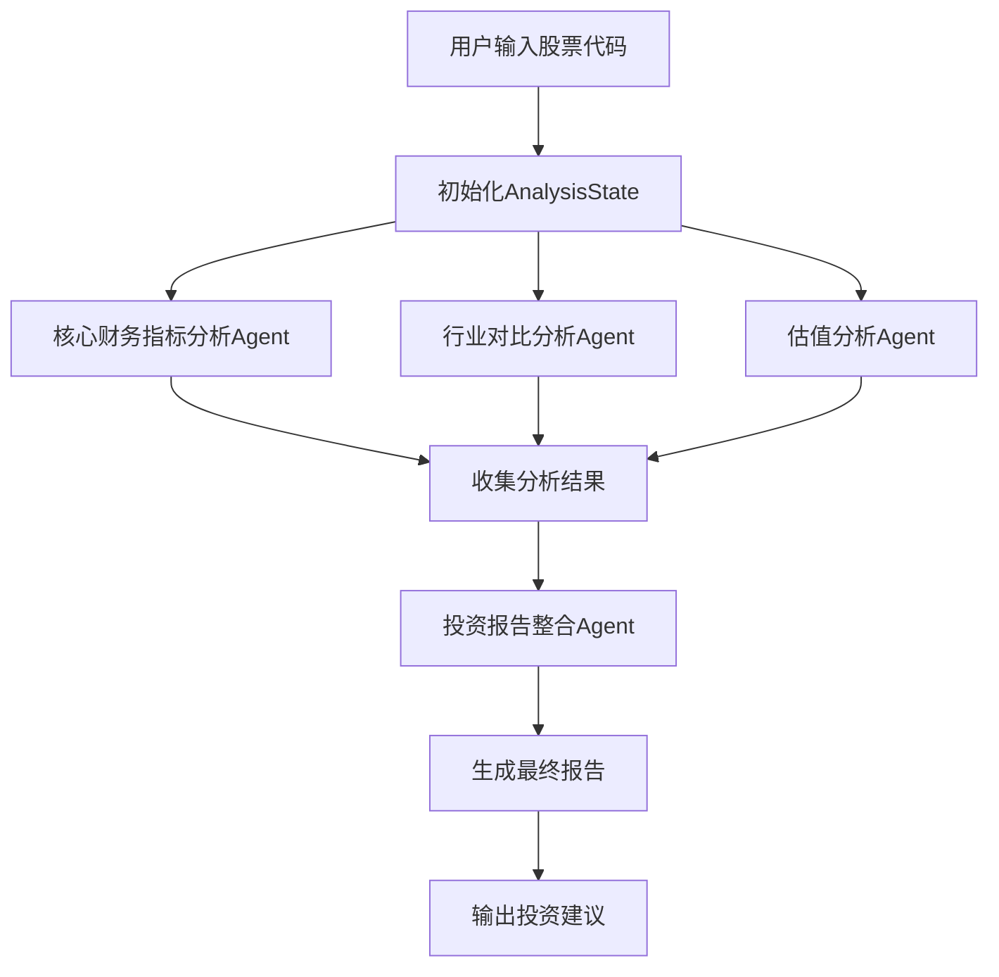

# A股分析Multi-Agent系统架构设计

## 🎯 系统概述

### 设计目标
构建一套专业的A股公司投资价值分析系统，通过4个专业化Agent协作，生成包含数据来源的结构化投资分析报告。

### 核心原则
- **专业分工**：每个Agent专注特定分析领域
- **数据驱动**：所有分析基于A股数据API和MCP服务
- **可追溯性**：所有结论都有明确的数据来源
- **标准化输出**：采用金字塔原理的报告结构

---

## 🏗️ 总体架构设计

### 架构模式
采用TradingAgents成熟的**分层协作模式**，结合A股市场特点设计：

```
┌─────────────────────────────────────────────────────────────┐
│                   A股投资分析系统                              │
├─────────────────────────────────────────────────────────────┤
│                  信息整合层 (Layer 4)                         │
│  ┌─────────────────────────────────────────────────────────┐ │
│  │            投资分析报告整合Agent                          │ │
│  │    • 金字塔原理报告生成                                  │ │
│  │    • 多维度结论综合                                      │ │
│  │    • 投资建议输出                                        │ │
│  └─────────────────────────────────────────────────────────┘ │
├─────────────────────────────────────────────────────────────┤
│                  专业分析层 (Layer 3)                         │
│  ┌─────────────┐ ┌─────────────┐ ┌─────────────────────────┐ │
│  │ 核心财务指标 │ │ 行业对比与   │ │ 估值与市场信号分析      │ │
│  │ 分析Agent   │ │ 竞争优势     │ │ Agent                  │ │
│  │             │ │ 分析Agent   │ │                        │ │
│  │• 营收净利润 │ │• 行业增长率 │ │• 股权变动分析          │ │
│  │• ROE分析    │ │• 毛利率对比 │ │• 股东结构分析          │ │
│  │• 资产负债表 │ │• 竞争地位   │ │• PR=PE/ROE估值         │ │
│  │• 现金流分析 │ │• 行业地位   │ │• 市场信号解读          │ │
│  │• 股东回报   │ │             │ │                        │ │
│  └─────────────┘ └─────────────┘ └─────────────────────────┘ │
├─────────────────────────────────────────────────────────────┤
│                  数据获取层 (Layer 2)                         │
│  ┌─────────────────────────────────────────────────────────┐ │
│  │                  A股数据工具集                           │ │
│  │  • A股数据API (17个财务分析接口)                         │ │
│  │  • MCP服务 (实时数据查询)                               │ │
│  │  • 技术指标计算                                          │ │
│  │  • 行业对比数据                                          │ │
│  └─────────────────────────────────────────────────────────┘ │
├─────────────────────────────────────────────────────────────┤
│                  基础设施层 (Layer 1)                         │
│  ┌─────────────────────────────────────────────────────────┐ │
│  │                   系统基础组件                           │ │
│  │  • LLM配置 (自定义OpenAPI endpoint)                     │ │
│  │  • 状态管理 (AnalysisState)                            │ │
│  │  • 内存管理 (分析历史记录)                               │ │
│  │  • 工作流控制 (LangGraph)                              │ │
│  └─────────────────────────────────────────────────────────┘ │
└─────────────────────────────────────────────────────────────┘
```

---

## 🔧 Agent详细设计

### 1. 核心财务指标分析Agent

**功能定位**：专注公司财务健康度和盈利能力分析

**核心职责**：
- **营收与净利润分析**：历史增长趋势、季度/年度对比
- **净资产收益率分析**：ROE健康度评估、同行业对比
- **资产负债表分析**：资产结构、负债水平、偿债能力
- **现金流分析**：经营性现金流、现金流与净利润匹配度
- **股东回报分析**：分红历史、分红率、股东回报水平

**关键数据源**：
```python
# 主要使用的API接口
- get_financial_reports()      # 财务报表数据
- get_latest_financial_reports() # 最新财报
- calculate_financial_ratios() # 财务比率计算
- get_financial_summary()     # 财务摘要
```

**输出格式**：
```markdown
## 核心财务指标分析报告

### 1. 营收与净利润分析
- 营收增长率：X%（数据来源：2024Q3财报）
- 净利润增长率：X%（数据来源：近3年年报对比）
- 增长趋势评估：[稳定增长/波动/下滑]

### 2. 净资产收益率分析  
- 当前ROE：X%（数据来源：最新年报）
- 行业平均ROE：X%（数据来源：同行业对比）
- ROE健康度：[优秀/良好/一般/较差]

### 3. 资产负债表健康度
- 资产负债率：X%
- 流动比率：X
- 资产结构评估：[健康/需关注/风险]

### 4. 现金流状况
- 经营性现金流净额：X万元
- 现金流/净利润比：X
- 现金流健康度：[优秀/良好/一般/较差]

### 5. 股东回报水平
- 近3年平均分红率：X%
- 分红稳定性：[稳定/波动/无分红]
- 股东回报评级：[优秀/良好/一般/较差]

**综合评分**：X/10分
**核心结论**：[基于财务指标的投资建议]
```

### 2. 行业对比与竞争优势分析Agent

**功能定位**：分析公司在行业中的竞争地位和优势

**核心职责**：
- **行业增长分析**：所属行业的历史和预期增长情况
- **关键指标对比**：毛利率、净利率、ROE与行业头部企业对比
- **市场地位分析**：市场份额、行业排名、竞争优势
- **护城河分析**：技术壁垒、品牌优势、规模效应等

**关键数据源**：
```python
# 主要使用的API和工具
- get_stocks()                 # 同行业股票筛选
- get_financial_summary()      # 批量获取同行业财务数据
- calculate_financial_ratios() # 行业对比分析
- get_indices()               # 行业指数数据
- get_index_constituents()    # 行业成分股分析
```

**输出格式**：
```markdown
## 行业对比与竞争优势分析报告

### 1. 行业基本情况
- 所属行业：[具体行业分类]
- 行业近3年增长率：X%（数据来源：行业统计）
- 行业发展阶段：[成长期/成熟期/衰退期]

### 2. 关键财务指标行业对比
| 指标 | 目标公司 | 行业平均 | 行业第一 | 排名 |
|------|----------|----------|----------|------|
| 毛利率 | X% | X% | X% | X/X |
| 净利率 | X% | X% | X% | X/X |
| ROE | X% | X% | X% | X/X |

### 3. 竞争地位分析
- 市场份额：X%（数据来源：行业报告）
- 行业排名：第X位
- 主要竞争对手：[公司A, 公司B, 公司C]

### 4. 竞争优势识别
- 技术优势：[有/无] - [具体优势描述]
- 品牌优势：[有/无] - [品牌影响力分析]
- 规模优势：[有/无] - [规模经济效应]
- 渠道优势：[有/无] - [销售渠道分析]

**竞争力评分**：X/10分
**核心结论**：[公司在行业中的竞争地位评估]
```

### 3. 估值与市场信号分析Agent

**功能定位**：评估公司估值水平和市场信号

**核心职责**：
- **股权变动分析**：大股东减持、股权质押等异常变动
- **股东结构分析**：股东类型、持股集中度、机构投资者比例
- **估值分析**：采用PR=PE/ROE公式进行长期估值分析
- **市场信号解读**：技术指标、资金流向、市场情绪

**关键数据源**：
```python
# 主要使用的API和工具
- get_daily_quotes()          # 股价和技术指标
- calculate_technical_indicators() # 技术分析
- get_stock_detail()          # 股票详细信息
- analyze_market_trend()      # 市场趋势分析
```

**输出格式**：
```markdown
## 估值与市场信号分析报告

### 1. 股权变动情况
- 近6个月大股东减持：[有/无] - [具体情况]
- 股权质押比例：X%（数据来源：公告信息）
- 异常股权变动：[有/无] - [风险评估]

### 2. 股东结构分析
- 第一大股东持股比例：X%
- 前十大股东持股比例：X%
- 机构投资者持股比例：X%
- 股东结构特点：[集中/分散] - [稳定性分析]

### 3. 估值水平分析
- 当前PE：X倍（数据来源：最新市场数据）
- 当前PB：X倍
- PR值(PE/ROE)：X（数据来源：计算得出）
- 历史PR均值：X - 当前估值[低估/合理/高估]

### 4. 市场信号分析
- 技术指标信号：[看涨/中性/看跌]
- 资金流向：[净流入/净流出] X万元
- 市场情绪：[乐观/中性/悲观]

**估值评分**：X/10分
**核心结论**：[当前估值水平和投资时机分析]
```

### 4. 投资分析报告整合Agent

**功能定位**：整合前三个Agent的分析结果，生成最终投资报告

**核心职责**：
- **金字塔原理报告生成**：结论先行，逐层支撑
- **多维度评分整合**：财务、竞争力、估值的综合评分
- **投资建议输出**：明确的买入/持有/卖出建议
- **风险提示**：关键风险点和注意事项

**输出格式**：
```markdown
# [股票代码] [公司名称] 投资价值分析报告

## 🎯 投资建议总结
**最终建议**：[强烈推荐/推荐/中性/不推荐/强烈不推荐]
**目标价格**：X元（基于PR估值模型）
**投资时间**：[短期/中期/长期]
**核心逻辑**：[一句话总结投资价值]

## 📊 综合评分
| 维度 | 评分 | 权重 | 加权得分 |
|------|------|------|----------|
| 财务质量 | X/10 | 40% | X |
| 竞争优势 | X/10 | 30% | X |
| 估值水平 | X/10 | 30% | X |
| **综合得分** | **X/10** | 100% | **X** |

## 💡 关键投资亮点
1. **财务表现**：[关键财务优势]
2. **竞争地位**：[核心竞争优势]
3. **估值机会**：[估值优势分析]

## ⚠️ 主要风险提示
1. **财务风险**：[如负债率过高]
2. **行业风险**：[如行业周期性]
3. **市场风险**：[如估值过高]

## 📈 详细分析报告
### 财务指标分析
[引用财务分析Agent的详细报告]

### 行业竞争分析
[引用行业分析Agent的详细报告]

### 估值与市场信号
[引用估值分析Agent的详细报告]

---
**报告生成时间**：[时间戳]
**数据来源**：A股数据API、MCP服务
**免责声明**：本报告仅供参考，不构成投资建议
```

---

## 📊 状态管理设计

### AnalysisState定义
```python
from typing import Annotated, Optional
from typing_extensions import TypedDict
from langchain_core.messages import BaseMessage

class AnalysisState(TypedDict):
    # 基础信息
    stock_symbol: Annotated[str, "股票代码，如000001"]
    company_name: Annotated[str, "公司名称，如平安银行"]
    analysis_date: Annotated[str, "分析日期，YYYY-MM-DD格式"]
    
    # 消息历史
    messages: Annotated[list[BaseMessage], "Agent间的消息历史"]
    
    # 分析报告（各Agent输出）
    financial_analysis: Annotated[Optional[str], "核心财务指标分析报告"]
    industry_analysis: Annotated[Optional[str], "行业对比与竞争优势分析报告"]
    valuation_analysis: Annotated[Optional[str], "估值与市场信号分析报告"]
    
    # 评分结果
    financial_score: Annotated[Optional[float], "财务质量评分 (0-10)"]
    competition_score: Annotated[Optional[float], "竞争优势评分 (0-10)"]
    valuation_score: Annotated[Optional[float], "估值水平评分 (0-10)"]
    
    # 最终输出
    final_report: Annotated[Optional[str], "最终投资分析报告"]
    investment_recommendation: Annotated[Optional[str], "投资建议：强烈推荐/推荐/中性/不推荐/强烈不推荐"]
    target_price: Annotated[Optional[float], "目标价格"]
    
    # 数据来源追踪
    data_sources: Annotated[list[str], "使用的数据源列表"]
    
    # 错误处理
    errors: Annotated[list[str], "处理过程中的错误信息"]
    warnings: Annotated[list[str], "警告信息"]
```

---

## 🔄 工作流设计

### 1. 执行流程


### 2. 并行处理设计
```python
# 三个分析Agent可以并行执行，提升效率
async def parallel_analysis(state: AnalysisState):
    tasks = [
        financial_analysis_agent(state),
        industry_analysis_agent(state),
        valuation_analysis_agent(state)
    ]
    results = await asyncio.gather(*tasks)
    return merge_results(results)
```

### 3. 错误处理机制
```python
def error_handler(func):
    def wrapper(state: AnalysisState):
        try:
            return func(state)
        except Exception as e:
            state['errors'].append(f"{func.__name__}: {str(e)}")
            return state
    return wrapper
```

---

## 🛠️ 技术实现要点

### 1. LLM配置
```python
# 使用用户提供的自定义endpoint
DEFAULT_CONFIG = {
    "llm_provider": "openai",
    "deep_think_llm": "gpt-4o",  # 用于复杂分析
    "quick_think_llm": "gpt-4o-mini",  # 用于简单处理
    "backend_url": "https://oned.lvtu.in",  # 用户自定义endpoint
    "local_llm_url": "http://localhost:10000",  # 本地Ollama
}
```

### 2. 数据源集成
```python
# A股数据API工具集
class AShareToolkit:
    def __init__(self, config):
        self.api_client = AShareAPIClient(base_url="http://localhost:8000/api/v1")
        self.mcp_client = MCPClient(endpoint="ws://server.com:8001")
    
    async def get_financial_data(self, symbol: str):
        # 整合API和MCP服务的数据获取
        pass
```

### 3. 内存管理
```python
# 参考TradingAgents的内存设计
class AnalysisMemory(FinancialSituationMemory):
    def __init__(self, agent_name: str, config: dict):
        super().__init__(agent_name, config)
        self.analysis_history = []
    
    def save_analysis(self, symbol: str, report: str):
        # 保存分析历史，用于学习改进
        pass
```

---

## 📁 目录结构设计

```
tradingagents/analysis_stock_agent/
├── __init__.py
├── agents/
│   ├── __init__.py
│   ├── financial_analysis_agent.py     # 核心财务指标分析Agent
│   ├── industry_analysis_agent.py      # 行业对比分析Agent
│   ├── valuation_analysis_agent.py     # 估值分析Agent
│   └── report_integration_agent.py     # 报告整合Agent
├── tools/
│   ├── __init__.py
│   ├── ashare_toolkit.py              # A股数据工具集
│   └── mcp_integration.py             # MCP服务集成
├── utils/
│   ├── __init__.py
│   ├── analysis_states.py             # 状态定义
│   ├── report_formatter.py            # 报告格式化
│   └── data_validator.py              # 数据验证
├── graph/
│   ├── __init__.py
│   ├── analysis_graph.py              # 主要的图设置
│   └── workflow_setup.py              # 工作流配置
├── memory/
│   ├── __init__.py
│   └── analysis_memory.py             # 分析历史记录
└── config/
    ├── __init__.py
    └── analysis_config.py             # 分析配置
```

---

## 🔧 配置与部署

### 1. 环境要求
- Python 3.13+
- A股数据API服务运行在 http://localhost:8000
- MCP服务连接（可选）
- 自定义LLM endpoint访问

### 2. 关键配置
```python
ANALYSIS_CONFIG = {
    # LLM配置
    "llm_provider": "openai",
    "analysis_llm": "gpt-4o",  # 主要分析模型
    "summary_llm": "gpt-4o-mini",  # 摘要生成模型
    "backend_url": "https://oned.lvtu.in",
    
    # 数据源配置
    "ashare_api_url": "http://localhost:8000/api/v1",
    "mcp_endpoint": "ws://server.com:8001",
    "use_mcp": True,  # 是否使用MCP服务
    
    # 分析参数
    "analysis_period": "3years",  # 分析时间范围
    "industry_comparison_count": 10,  # 行业对比公司数量
    "technical_indicators": ["ma", "rsi", "macd"],  # 技术指标
    
    # 报告配置
    "report_format": "markdown",
    "include_charts": False,  # 是否包含图表
    "language": "zh-CN",  # 报告语言
}
```

### 3. Docker部署（可选）
```dockerfile
# 如果需要独立部署，将在Phase 5提供完整的Docker配置
```

---

## ✅ 设计验证要点

### 1. 功能完整性检查
- ✅ 覆盖用户需求的4个核心Agent
- ✅ 集成A股数据API的17个工具
- ✅ 支持MCP服务调用
- ✅ 金字塔原理报告结构
- ✅ 数据来源可追溯

### 2. 技术兼容性检查
- ✅ 遵循TradingAgents架构模式
- ✅ 兼容LangGraph工作流框架
- ✅ 支持用户自定义LLM endpoint
- ✅ 支持本地Ollama模型

### 3. 扩展性检查
- ✅ 模块化设计，易于添加新Agent
- ✅ 配置驱动，易于调整参数
- ✅ 插件化工具集成
- ✅ 内存机制支持学习改进

---

**架构设计完成时间**：2025-08-15
**设计版本**：v1.0
**下一步**：技术方案制定和详细实现计划